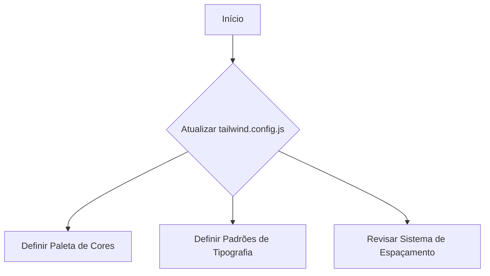
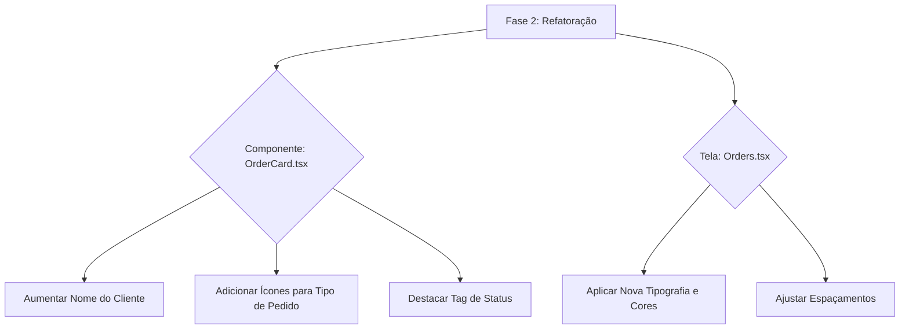

# Plano de Refatoração: Implementação do Design System com Tailwind CSS

## Contexto

Com base em um diagnóstico de UI/UX, esta refatoração visa implementar um Design System unificado para garantir consistência visual e melhorar a experiência do usuário na aplicação. A tecnologia central para esta implementação é o Tailwind CSS.

## Fases do Projeto

### Fase 1: Definir as Fundações do Design System no `tailwind.config.js`

O objetivo desta fase é estabelecer as bases visuais do projeto, garantindo que todos os novos componentes e telas sigam um padrão coeso.

1.  **Atualizar a Paleta de Cores:**
    - **Primária:** Definir um azul mais vibrante para elementos de destaque e interações principais.
    - **Secundária:** Definir uma cor para ações secundárias.
    - **Status:** Criar cores harmoniosas para sucesso (verde) e erro/destrutivo (vermelho).
2.  **Padronizar a Tipografia:**
    - Adicionar uma seção `fontSize` no `theme.extend` para criar classes de texto padronizadas (ex: `text-h1`, `text-body`).
3.  **Estruturar o Espaçamento:**
    - Assegurar que a aplicação utilize consistentemente os múltiplos de 8px do sistema de espaçamento do Tailwind para `padding`, `margin` e `gap`.

### Fase 2: Refatorar a Tela de Pedidos como Prova de Conceito

Esta fase aplicará o novo Design System a um componente e tela críticos para validar a abordagem e servir como exemplo para futuras refatorações.

1.  **Refatorar `src/components/orders/OrderCard.tsx`:**
    - **Hierarquia Visual:**
      - Aumentar o tamanho da fonte do nome do cliente (`font-bold text-lg`).
      - Utilizar ícones (`lucide-react`) para diferenciar "Delivery" e "Retirada".
      - Tornar a tag de status do pedido mais proeminente com as novas cores de status.
    - **Limpeza de Código:** Substituir quaisquer estilos inline ou classes de CSS customizadas por classes utilitárias do Tailwind.
2.  **Refatorar `src/screens/Orders/Orders.tsx`:**
    - Aplicar as novas classes de tipografia para títulos e descrições.
    - Ajustar os espaçamentos entre os elementos (filtros, cards) para seguir o padrão de 8px.
    - Garantir que os botões e badges de filtro utilizem as novas cores primárias e secundárias.

