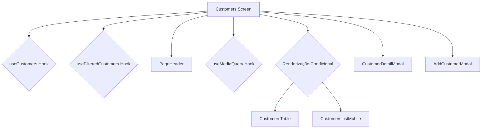

# Plano de Refatoração Abrangente do Projeto React

## 1. Introdução

Este documento detalha um plano de refatoração para toda a base de código do projeto. O objetivo é melhorar a manutenibilidade, legibilidade e organização do código, aplicando práticas de "clean code" e separando responsabilidades, sem alterar o design ou a funcionalidade existente da aplicação. Esta versão expande o plano inicial para incluir todas as áreas principais da aplicação.

## 2. Análise e Diagnóstico Geral

- **Componentes Monolíticos:** Componentes como `OrderCard` e telas como `Orders` e `Customers` são grandes e acumulam múltiplas responsabilidades (UI, estado, lógica de negócio).
- **Lógica de Negócio na UI:** Regras de negócio, filtragem e ordenação estão frequentemente acopladas aos componentes de UI.
- **Acesso Direto a Dados:** Alguns componentes realizam chamadas diretas à camada de dados, violando a separação de camadas.
- **Renderização Condicional Complexa:** A lógica para renderizar layouts diferentes (ex: desktop vs. mobile) dentro do mesmo componente torna o código difícil de ler e manter.
- **Falta de Componentes Reutilizáveis:** Blocos de UI, como cabeçalhos de página e displays de erro, são duplicados em vez de serem componentes reutilizáveis.

## 3. Plano de Ação Priorizado

### Passo 1: Melhorias Globais e Hooks Reutilizáveis

Criar uma base de componentes e hooks reutilizáveis que servirão para toda a aplicação.

**Ações:**

1.  **Criar Hook `useMediaQuery`:** Extrair a lógica de detecção de tamanho de tela (encontrada em `Customers.tsx`) para um hook reutilizável `src/hooks/useMediaQuery.ts`. Isso centralizará a lógica de responsividade.
2.  **Criar Componente `PageHeader.tsx`:** Criar um componente genérico para cabeçalhos de página, que pode aceitar um título, uma descrição e botões de ação. Será usado em `Orders`, `Customers`, etc.
3.  **Criar Componente `ErrorDisplay.tsx`:** Criar um componente para exibir mensagens de erro de forma padronizada, como o que é usado em `Dashboard.tsx`.
4.  **Criar Componente `LoadingSpinner.tsx`:** Padronizar os indicadores de carregamento, como o `Loader2` usado em `Customers.tsx`.

### Passo 2: Refatoração da Seção de Pedidos (`Orders`)

_(Conforme plano anterior, agora integrado ao fluxo geral)_

**Ações:**

1.  **Centralizar Lógica:** Mover `allowedStatusTransitions` para `src/services/orderLogicService.ts` e abstrair o acesso a dados para `orderService.ts`.
2.  **Criar Hook `useFilteredOrders`:** Extrair a lógica de filtragem e ordenação da tela `Orders.tsx` para este hook.
3.  **Dividir `OrderCard.tsx`:**
    - `OrderStatusBadge.tsx`
    - `OrderTypeTooltip.tsx`
    - `OrderItemsList.tsx`
    - `OrderStatusActions.tsx`
4.  **Dividir Tela `Orders.tsx`:**
    - Extrair a UI de filtros para `OrderFilters.tsx`.
    - Simplificar `Orders.tsx` para orquestrar os componentes e hooks.

### Passo 3: Refatoração da Seção de Clientes (`Customers`)

A tela `Customers` será refatorada para separar a lógica de estado, a busca de dados e a renderização da UI.

**Estrutura Proposta:**

**Ações:**

1.  **Extrair Lógica de Filtragem:** Criar um hook `useFilteredCustomers(customers, searchTerm)` para encapsular a lógica de `useMemo` que hoje está no componente.
2.  **Dividir Componentes de UI:**
    - Criar `CustomersTable.tsx` para a visualização em desktop.
    - Criar `CustomersListMobile.tsx` para a visualização em cards para mobile.
3.  **Simplificar `Customers.tsx`:** O componente principal irá:
    - Usar o hook `useMediaQuery` (do Passo 1).
    - Chamar os hooks `useCustomers` e `useFilteredCustomers`.
    - Renderizar o `PageHeader` (do Passo 1).
    - Usar a renderização condicional para escolher entre `CustomersTable` e `CustomersListMobile`.
    - Gerenciar a abertura dos modais `CustomerDetailModal` e `AddCustomerModal`.

### Passo 4: Refatoração da Seção do Dashboard

Embora já esteja bem estruturado, podemos melhorar a clareza e o reuso.

**Ações:**

1.  **Extrair Componente `QuickStats.tsx`:** O card "Estatísticas Rápidas", que exibe o crescimento da receita e clientes ativos, será movido para seu próprio componente em `src/components/dashboard/QuickStats.tsx`.
2.  **Integrar `ErrorDisplay`:** Substituir o bloco de JSX de tratamento de erro pelo componente `ErrorDisplay.tsx` criado no Passo 1.

### Passo 5: Organização e Limpeza Final de Arquivos

**Ações:**

1.  **Resolver Duplicata `OrderCard.tsx`:** Unificar o código, manter a versão em `src/components/orders/OrderCard.tsx` e remover a outra, atualizando todas as importações.
2.  **Revisar Estrutura de Pastas:** Garantir que todos os novos componentes estejam em locais lógicos e consistentes. Por exemplo, `CustomersTable.tsx` e `CustomersListMobile.tsx` podem ir para `src/components/customers/`.

## 4. Conclusão

Este plano abrangente visa elevar a qualidade de toda a base de código. A execução destes passos resultará em uma aplicação mais modular, consistente, fácil de manter e com maior potencial de reuso de código.
